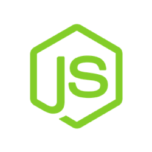

# Nuxt-crud

Express nodeJs Server and Nuxt Vuetify Client crud.

&nbsp;&nbsp;&nbsp;&nbsp;&nbsp;&nbsp;&nbsp;&nbsp;&nbsp;&nbsp;&nbsp;&nbsp;&nbsp;&nbsp;&nbsp;&nbsp;&nbsp;&nbsp;&nbsp;&nbsp;&nbsp;&nbsp;&nbsp;&nbsp;&nbsp;

<a href="server/">Server</a> and <a href="client/">Client</a> development stack managed under <a href="https://vuejs.org/v2/style-guide/" target="_blank"> Vue style guide</a> and <a href="https://vuex.vuejs.org/" target="_blank"> Vuex </a>. <a href="https://www.mongodb.com/" target="_blank">MongoDB </a> + <a href="http://expressjs.com/" target="_blank">Express </a> + <a href="https://vuejs.org/" target="_blank"> VueJS </a> + <a href="https://nuxtjs.org/" target="_blank"> NuxtJS </a> + <a href="https://nodejs.org/en/" target="_blank">NodeJS </a> code with docker-compose file.  <a href="https://vuetifyjs.com/en/" target="_blank">Vuetify </a> as a material design framework. </a>  Environment variables handled with <a href="https://www.npmjs.com/package/dotenv" target="_blank">dotenv.</a>  Server unit testing with <a href="https://mochajs.org/" target="_blank">Mocha</a>.</a>  Client functional testing with <a href="https://cypress.io/" target="_blank">Cypress</a> 

<a href="https://mevn-scaffold.herokuapp.com" target="_blank">Live demo Unknown yet</a>

## Prerequisites

- MongoDB
- Express 
- Vue
- Node
- Vuetify
- Nuxt
- Docker

### How do I start?

1. Clone this repository.   
2. Go <a href="server/">server</a> folder to set up and run the api server. 
3. Go <a href="client/">client</a> folder to set up set up and run the app.

#### License
See the [LICENSE](LICENSE.md) file for license rights and limitations (MIT).

 
